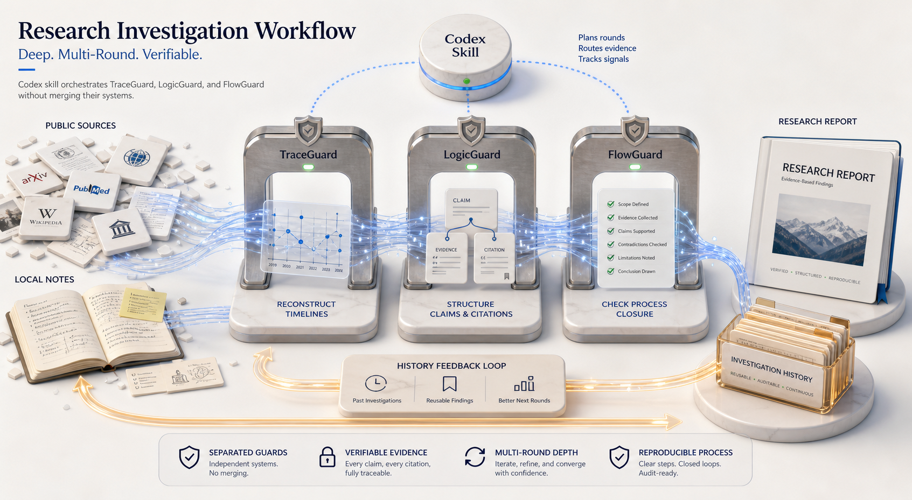

# Research Investigation Workflow

<!-- README HERO START -->
<p align="center">
  
</p>

<p align="center">
  <strong>A Codex skill for deep multi-round investigations with separated evidence, reasoning, and process guards.</strong>
</p>
<!-- README HERO END -->

- **Current version:** `v0.2.0`
- **Surface:** Codex skill and reference workflow, not a standalone app
- **Guard stack:** SourceGuard, TraceGuard, LogicGuard, FlowGuard, and a local Research Investigation History Ledger
- **Language note:** English comes first; the second half is a Chinese mirror.

Research Investigation Workflow is a Codex skill for planning and running source-backed investigation work over multiple rounds. It coordinates existing Guard-family workflows instead of inventing a new reasoning engine: SourceGuard plans source discovery and access-gap handling, TraceGuard reconstructs evidence-backed timelines and storylines, LogicGuard preserves sources and checks whether claims are structurally supported, and FlowGuard keeps the process ordered, current, and honestly closed.

The core rule is simple: investigation depth is measured by pursued logic leads and evidence chains, not by source counts or shallow/medium/deep modes.

Version `v0.2.0` adds SourceGuard as the default source-discovery planner for substantive investigations. Before broad search, the skill now builds a source-discovery state, ranks public/local/internal/counter/effect evidence actions, records observations and access gaps, and routes missing-source problems back to SourceGuard before TraceGuard, LogicGuard, or final prose can overclaim.

## Why It Exists

Long research runs fail when evidence, interpretation, report prose, and process notes collapse into one undifferentiated pile. This skill keeps those layers separate:

```text
source discovery -> SourceGuard belief state and search actions
messy evidence -> TraceGuard case work
formal source support -> LogicGuard source and claim work
process freshness -> FlowGuard closure work
run-level lessons -> Research Investigation History Ledger
```

The result is a report workflow that can say what is supported, what is contradicted, what is only an official claim, what still needs evidence, and what should be downgraded before publication.

## What It Orchestrates

| Layer | Owned by | Used for |
| --- | --- | --- |
| Source discovery | SourceGuard | Search planning, candidate source records, source-role coverage, local/internal/public access gaps, counter-source and follow-up actions |
| Messy case evidence | TraceGuard Case Library | Sources, evidence snippets, search directions, timelines, contradictions, gaps, and safe wording |
| Durable source support | LogicGuard Source Library | Preserved sources, claim-to-source matrices, source roles, paragraph blueprints, and final claim audits |
| Process and closure | FlowGuard | Stage order, changed artifacts, stale evidence, revalidation, skipped checks, and completion claims |
| Run memory | Research Investigation History Ledger | Reusable workflow lessons, useful search directions, prior run summaries, and local artifact pointers |

These stores are deliberately not merged. A saved source, a history record, a confidence score, or a hypothesis is not factual proof by itself.

## Guard Stack Repositories

This workflow depends on separate Guard-family skills and keeps their responsibilities distinct:

| Sub-skill / tool | Repository | Role in this workflow |
| --- | --- | --- |
| SourceGuard | [liuyingxuvka/SourceGuard](https://github.com/liuyingxuvka/SourceGuard) | Plans source discovery, ranks search actions, records candidate sources, anchors, observations, and access gaps |
| TraceGuard | [liuyingxuvka/TraceGuard](https://github.com/liuyingxuvka/TraceGuard) | Reconstructs event chains, storylines, contradictions, gaps, and claim boundaries from anchored evidence |
| LogicGuard | [liuyingxuvka/LogicGuard](https://github.com/liuyingxuvka/LogicGuard) | Preserves durable sources and audits whether final claims follow from declared support |
| FlowGuard | [liuyingxuvka/FlowGuard](https://github.com/liuyingxuvka/FlowGuard) | Checks process order, validation freshness, skipped checks, and completion claims |

The Research Investigation History Ledger is local workflow memory inside this repository's skill contract, not a separate public sub-skill repository.

## Main Workflow

```text
history preflight
-> goal and evidence policy
-> logic-lead map
-> SourceGuard source-discovery state
-> ranked source search and preservation
-> SourceGuard observation update
-> TraceGuard lead/event/evidence-chain model
-> SourceGuard gap-driven follow-up search
-> LogicGuard claim-to-source matrix
-> section and paragraph blueprint
-> citation-grounded report
-> LogicGuard final claim audit
-> FlowGuard closure check
-> final report plus local history postflight
```

The workflow continues until the requested claim strength is supported, important evidence is inaccessible, remaining gaps are explicitly accepted, or claims are downgraded to match the evidence.

## What The Final Report Should Contain

- readable findings first, appendix material second;
- inline citation markers for important claims;
- source roles such as event fact, official claim, independent report, limiting evidence, expert analysis, historical background, or hypothesis;
- visible "who says this" wording when a paragraph mixes direct facts, source claims, interpretation, and the report's inference;
- completion or downgrade status for original-fact, counter/limiting, impact/execution, stakeholder, and future-trigger rounds;
- a source-discovery coverage table that separates planned searches, completed searches, access gaps, and candidate-source downgrades;
- a logic-lead coverage table;
- an event/evidence timeline or storyline when relevant;
- a claim-to-source matrix;
- unresolved gaps and watchlist items;
- TraceGuard, LogicGuard, FlowGuard, and History Ledger closure summaries.

## Good Fit

Use this skill when Codex needs to investigate a topic, reconstruct a timeline, separate findings from hypotheses, compare competing explanations, synthesize a sourced report, or reuse lessons from a previous investigation run.

It is especially useful when the work needs more than a single answer pass: follow-up searches, contradictions, source promotion, report structure, citation placement, and final claim audit all matter.

## Not A Fit

This repository does not provide a UI, database server, crawler, truth oracle, official PSL runtime, or combined all-in-one research engine. It also does not replace SourceGuard, TraceGuard, LogicGuard, or FlowGuard. The skill is a thin orchestration layer over those existing systems.

## Quick Start

Install the Codex skill from this repository path:

```powershell
python "$env:USERPROFILE\.codex\skills\.system\skill-installer\scripts\install-skill-from-github.py" `
  --repo liuyingxuvka/research-investigation-workflow `
  --path skills/research-investigation-workflow
```

Then ask Codex to use the skill for a substantive investigation:

```text
Use research-investigation-workflow to investigate this topic and produce a sourced report.
```

The skill will read its reference contracts under `skills/research-investigation-workflow/references/` and route work to SourceGuard, TraceGuard, LogicGuard, and FlowGuard as needed.

## Public Boundary

This repository contains the skill instructions, reference contracts, OpenSpec change records, and FlowGuard implementation evidence needed to maintain the workflow. It intentionally excludes local investigation outputs.

Do not commit generated reports, TraceGuard cases, LogicGuard source libraries, Research Investigation History Ledger records, local notes, credentials, or machine-specific configuration unless a separate sanitized sample is explicitly approved.

## Repository Layout

```text
skills/research-investigation-workflow/  Installable Codex skill source
docs/                                    Planning notes and Guard-family basis
openspec/                                Change proposals, specs, and task records
.flowguard/                              Local FlowGuard models and adoption log
assets/readme-hero/                      README concept hero image and design notes
VERSION                                  Current public version
CHANGELOG.md                            Release history
```

---

# Research Investigation Workflow 中文镜像

- **当前版本：** `v0.2.0`
- **形态：** Codex skill 和 reference workflow，不是独立 app
- **Guard stack：** SourceGuard、TraceGuard、LogicGuard、FlowGuard 和本地 Research Investigation History Ledger

Research Investigation Workflow 是一个用于多轮调查研究的 Codex skill。它不新造一套推理引擎，而是编排已有 Guard-family 工作流：SourceGuard 负责规划证据来源发现和访问缺口，TraceGuard 负责把证据重建成时间线和故事线，LogicGuard 负责保存来源并检查结论是否被结构化支持，FlowGuard 负责让流程顺序、证据新鲜度和完成声明可审计。

核心规则是：调查深度不按来源数量或浅/中/深档位衡量，而按关键逻辑线索和证据链是否被追踪、限制、反驳、补证或降级来衡量。

`v0.2.0` 把 SourceGuard 纳入默认重型调查编排：先建立来源发现状态，排序公开/本地/内部/反证/执行证据的搜索动作，记录搜索观察和访问缺口，再把可用材料交给 TraceGuard 与 LogicGuard。缺来源的问题会回流到 SourceGuard，而不是直接写成结论。

## 为什么需要它

长研究任务容易把证据、解释、报告正文和流程笔记混在一起。这个 skill 把这些层次拆开：

```text
来源发现 -> SourceGuard belief state and search actions
杂乱证据 -> TraceGuard case work
正式来源支持 -> LogicGuard source and claim work
流程新鲜度 -> FlowGuard closure work
运行经验 -> Research Investigation History Ledger
```

这样最终报告可以清楚说明哪些结论被支持，哪些被反驳，哪些只是官方说法，哪些仍然缺证据，以及哪些表达必须在发布前降级。

## 它编排什么

| 层次 | 归属 | 用途 |
| --- | --- | --- |
| 来源发现 | SourceGuard | 搜索规划、候选来源记录、来源角色覆盖、本地/内部/公开访问缺口、反证和后续搜索动作 |
| 杂乱 case 证据 | TraceGuard Case Library | 来源、证据片段、搜索方向、时间线、矛盾、缺口和安全表述 |
| 稳定来源支持 | LogicGuard Source Library | 保存来源、claim-to-source matrix、来源角色、段落蓝图和最终 claim audit |
| 流程与闭环 | FlowGuard | 阶段顺序、变更过的 artifact、陈旧证据、重验证、跳过检查和完成声明 |
| 运行记忆 | Research Investigation History Ledger | 可复用的工作流经验、搜索方向、历史 run 摘要和本地 artifact 指针 |

这些存储边界不能合并。保存过的来源、历史记录、置信度分数或假设，本身都不是事实证明。

## Guard Stack 仓库

这个 workflow 依赖几个相互独立的 Guard-family 技能，并且保持它们的职责边界：

| 子技能 / 工具 | GitHub 仓库 | 在本 workflow 中的职责 |
| --- | --- | --- |
| SourceGuard | [liuyingxuvka/SourceGuard](https://github.com/liuyingxuvka/SourceGuard) | 规划来源发现、排序搜索动作、记录候选来源、锚点、观察和访问缺口 |
| TraceGuard | [liuyingxuvka/TraceGuard](https://github.com/liuyingxuvka/TraceGuard) | 基于已锚定证据重建事件链、故事线、矛盾、缺口和 claim boundary |
| LogicGuard | [liuyingxuvka/LogicGuard](https://github.com/liuyingxuvka/LogicGuard) | 保存稳定来源，并审核最终 claim 是否能从声明的支持中推出 |
| FlowGuard | [liuyingxuvka/FlowGuard](https://github.com/liuyingxuvka/FlowGuard) | 检查流程顺序、验证新鲜度、跳过检查和完成声明 |

Research Investigation History Ledger 是这个仓库技能合同里的本地 workflow 记忆，不是单独的公开子技能仓库。

## 主流程

```text
history preflight
-> 目标和证据策略
-> logic-lead map
-> SourceGuard 来源发现状态
-> 按价值排序搜索和保存来源
-> SourceGuard 搜索观察写回
-> TraceGuard lead/event/evidence-chain model
-> SourceGuard 按缺口继续补证
-> LogicGuard claim-to-source matrix
-> 章节和段落蓝图
-> 带正文引用的报告
-> LogicGuard final claim audit
-> FlowGuard closure check
-> 最终报告和本地 history postflight
```

流程会一直推进到：目标结论强度已有足够支持、关键证据无法取得、剩余缺口被明确接受，或结论被降级到证据能够支持的范围。

## 最终报告应该包含什么

- 先给可读主报告，再给 appendix；
- 重要 claim 有正文引用标记；
- 标明来源角色，例如 event fact、official claim、independent report、limiting evidence、expert analysis、historical background 或 hypothesis；
- 段落里混合事实、来源说法、解释和推论时，要能看出“是谁说的”和“我们推到哪里为止”；
- 标明原始事实、反证/限制、影响/执行、利益相关方和未来触发点五轮是否完成，未完成时降级闭合；
- source-discovery coverage table，区分计划搜索、完成搜索、访问缺口和候选来源降级；
- logic-lead coverage table；
- 相关的事件/证据时间线或故事线；
- claim-to-source matrix；
- unresolved gaps 和 watchlist；
- TraceGuard、LogicGuard、FlowGuard、History Ledger 的闭环摘要。

## 适合什么任务

当 Codex 需要调查一个主题、重建时间线、区分发现和假设、比较不同解释、合成有来源的报告，或复用过去类似调查的经验时，可以使用这个 skill。

它尤其适合不是一次回答就能结束的工作：后续搜索、矛盾处理、来源升级、报告结构、正文引用位置和最终 claim audit 都会影响结果质量。

## 不适合什么任务

这个仓库不提供 UI、数据库服务器、爬虫、事实真理机、官方 PSL runtime，也不是把所有功能合并到一起的新研究引擎。它只是一个薄编排层，不替代 SourceGuard、TraceGuard、LogicGuard 或 FlowGuard。

## 快速开始

从这个仓库路径安装 Codex skill：

```powershell
python "$env:USERPROFILE\.codex\skills\.system\skill-installer\scripts\install-skill-from-github.py" `
  --repo liuyingxuvka/research-investigation-workflow `
  --path skills/research-investigation-workflow
```

然后让 Codex 用它处理一个实质性调查任务：

```text
Use research-investigation-workflow to investigate this topic and produce a sourced report.
```

skill 会读取 `skills/research-investigation-workflow/references/` 下的 reference contracts，并按需要路由到 SourceGuard、TraceGuard、LogicGuard 和 FlowGuard。

## 公开边界

这个仓库只包含维护 workflow 所需的技能说明、reference contracts、OpenSpec 记录和 FlowGuard 实施证据。它有意不包含本地调查输出。

不要提交生成的报告、TraceGuard cases、LogicGuard source libraries、Research Investigation History Ledger records、本地笔记、凭据或机器专属配置，除非用户明确批准发布一个已经脱敏的样例。

## 仓库结构

```text
skills/research-investigation-workflow/  可安装的 Codex skill 源文件
docs/                                    规划说明和 Guard-family 基础
openspec/                                change proposal、spec 和 task 记录
.flowguard/                              本地 FlowGuard model 和 adoption log
assets/readme-hero/                      README concept hero 图和设计说明
VERSION                                  当前公开版本
CHANGELOG.md                            发布历史
```
